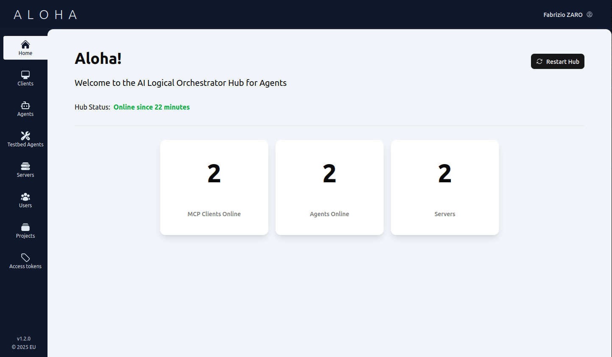
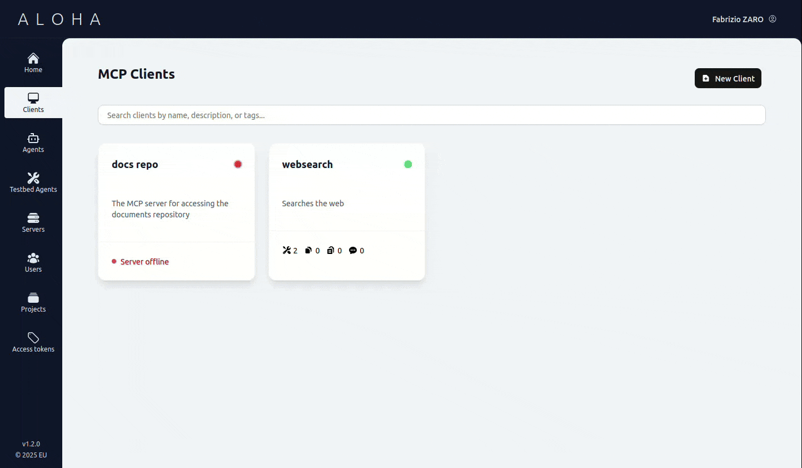
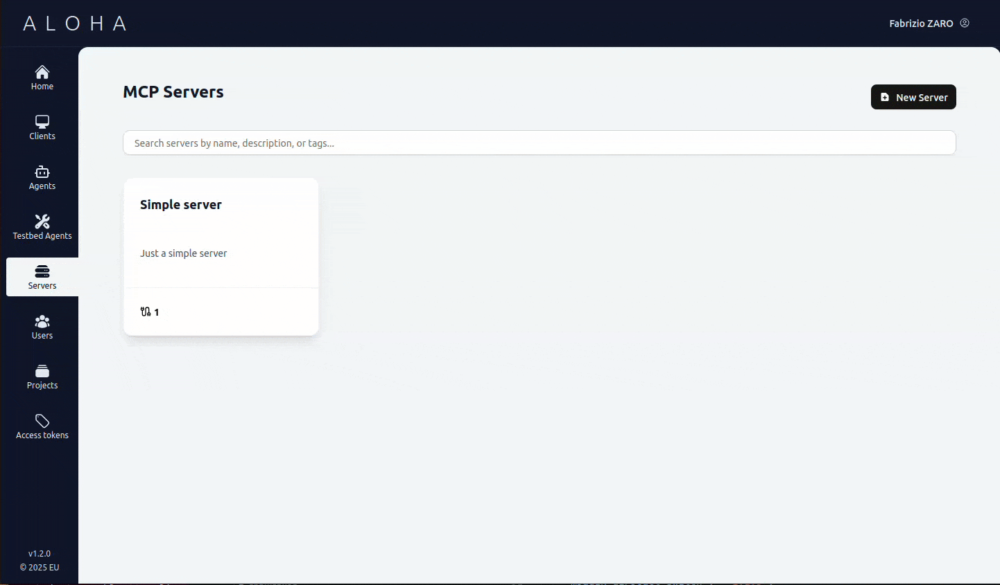
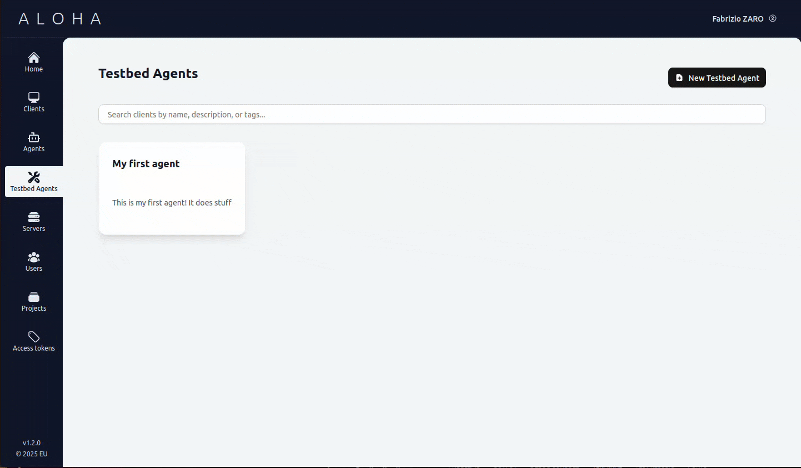

# ALOHA

Aloha (AI Logical Orchestrator Hub for Agents) is a centralized hub to manage and interconnect data and AI Agents. Built on the [Model Context Protocol (MCP)](https://modelcontextprotocol.io/) and [Agent-to-Agent (A2A) protocol](https://github.com/a2a-js/sdk), it enables communication between applications, MCP servers, and AI agents, enhancing tool discoverability and interoperability.

ALOHA provides out-of-the-box functionality to test MCP servers, connect A2A agents, and run demo agents directly in your browser.

[](docs/assets/homepage.png)

## Key Features

### MCP Server Management

- Connect to both local and remote MCP servers with support for different authentication strategies
- Test MCP server responses directly from the browser to debug and improve tools
- Supported authentication methods:
  - Basic authentication
  - Bearer token
  - OpenID Connect

[](docs/assets/MCP_clients.gif)

---

### A2A Agent Integration

- Register and manage A2A-compatible agents
- Send tasks to remote agents and receive streaming responses
- All agents act as MCP servers for tool access
- Assign MCP clients to agents through the UI

---

### Proxy Servers with Identity Propagation

- Easily deploy proxy servers to simplify connections between agents/applications and tools
- Single endpoint management with identity propagation (for OpenID Connect clients)
- Focus on writing only the essential code

[](docs/assets/MCP_servers.gif)

---

### Agent Development

- Run agentic loops directly in your browser using OpenAI-compatible endpoints
- Test MCP server and A2A agent performance with agent workflows

[](docs/assets/MCP_agent.gif)

---

## Documentation

For detailed user guides and platform documentation, see the [User Manual](docs/introduction.md).

---

## Quick Start

```bash
# Clone the repository, then:
cd aloha

# Install dependencies
npm install -g pnpm
pnpm install

# Build and run
pnpm lerna run build
pnpm lerna run start
```

## Deployment Options

### 1. Monorepo Setup (Recommended)

```bash
# Start development servers
pnpm lerna run dev
```

### 2. Docker Compose

```bash
# Start all services with Docker Compose
docker-compose up
```

### 3. Standalone Packages

First, build the shared packages, then run each package individually:

```bash
# Build shared packages
pnpm lerna run build --scope aloha-shared
```

On the first terminal run the server:

```bash
# Server (standalone)
pnpm lerna run dev --scope server
```

On another terminal run the client:

```bash
# Client (standalone)
pnpm lerna run dev --scope client
```

## Configuration

### Core Environment Variables

| Variable                | Description                      | Default Value                     |
| ----------------------- | -------------------------------- | --------------------------------- |
| `MONGODB_URI`           | MongoDB connection string        | `mongodb://127.0.0.1:27017/ALOHA` |
| `SERVER_PORT`           | Server HTTP port                 | `3000`                            |
| `VITE_SERVER_PORT`      | Client dev server port           | `5173`                            |
| `API_URL`               | Base API URL for client requests | `http://localhost`                |
| `SERVER_SECRET`         | Server authentication secret     | (required)                        |
| `CLIENT_SECRET`         | Client authentication secret     | (required)                        |
| `AUTHENTICATION_PLUGIN` | Path to custom auth plugin       | (optional)                        |

### Setup Instructions

1. **Create environment files**:

   ```bash
   # For monorepo setup
   cp .env.example .env
   cp packages/server/env.example packages/server/.env
   cp packages/client/env.example packages/client/.env

   # For standalone packages
   cd packages/server && cp env.example .env
   cd packages/client && cp env.example .env
   ```

2. **Configure MongoDB** (using Docker):
   ```bash
   mkdir ./mongodb_data
   docker run -p 27017:27017 \
     -v $PWD/mongodb_data:/data/db \
     --name mongodb \
     -it \
     --rm \
     docker.io/mongo
   ```

## Authentication System

ALOHA supports multiple authentication methods:

- **Plugin-based authentication** - Implement the `AuthenticationStrategy` interface from `aloha-shared` to create custom auth providers
- **OpenID Connect** - Built-in support for OIDC providers like Keycloak with identity propagation

### OpenID Connect Configuration

When using OpenID Connect, configure these environment variables:

| Variable                                    | Description                                      |
| ------------------------------------------- | ------------------------------------------------ |
| `OIDC_ENABLED`                              | Enable OIDC authentication                       |
| `OIDC_ISSUER_URL`                           | OIDC provider issuer URL (e.g., Keycloak realm) |
| `OIDC_CLIENT_ID`                            | OIDC client identifier                           |
| `OIDC_JWKS`                                 | JSON Web Key Set for token validation            |
| `OIDC_IDENTITY_PROPAGATION_SERVICE_PATH`    | Path to identity propagation service             |
| `OIDC_IDENTITY_PROPAGATION_REGISTRAR_PATH`  | Path to client registrar service                 |

### Example Plugin Implementation

```typescript
import { authentication_strategy } from "aloha-shared";
import { RequestHandler } from "express";

const myAuthPlugin: authentication_strategy.AuthenticationStrategy = {
  async getAuthenticationMiddleware(): Promise<
    RequestHandler | RequestHandler[]
  > {
    return [
      (req, res, next) => {
        const mockUser = {
          id: "123",
          userId: "userId",
          displayName: "John Doe",
          permissions: ["CLIENTS_READ", "SERVERS_WRITE"],
          provider: "SAMPLE",
        };

        authentication_strategy.storeUserIntoSession(req, mockUser);
        next();
      },
    ];
  },

  async checkPermissions(user, requiredPermissions) {
    return requiredPermissions.every((perm) => user.permissions.includes(perm));
  },

  async login() {
    return (req, res, next) => {
      // Login logic
      next();
    };
  },

  async logout() {
    return (req, res, next) => {
      // Logout logic
      next();
    };
  },

  async getInfo() {
    return { provider: "CUSTOM" };
  },
};

export default myAuthPlugin;
```
